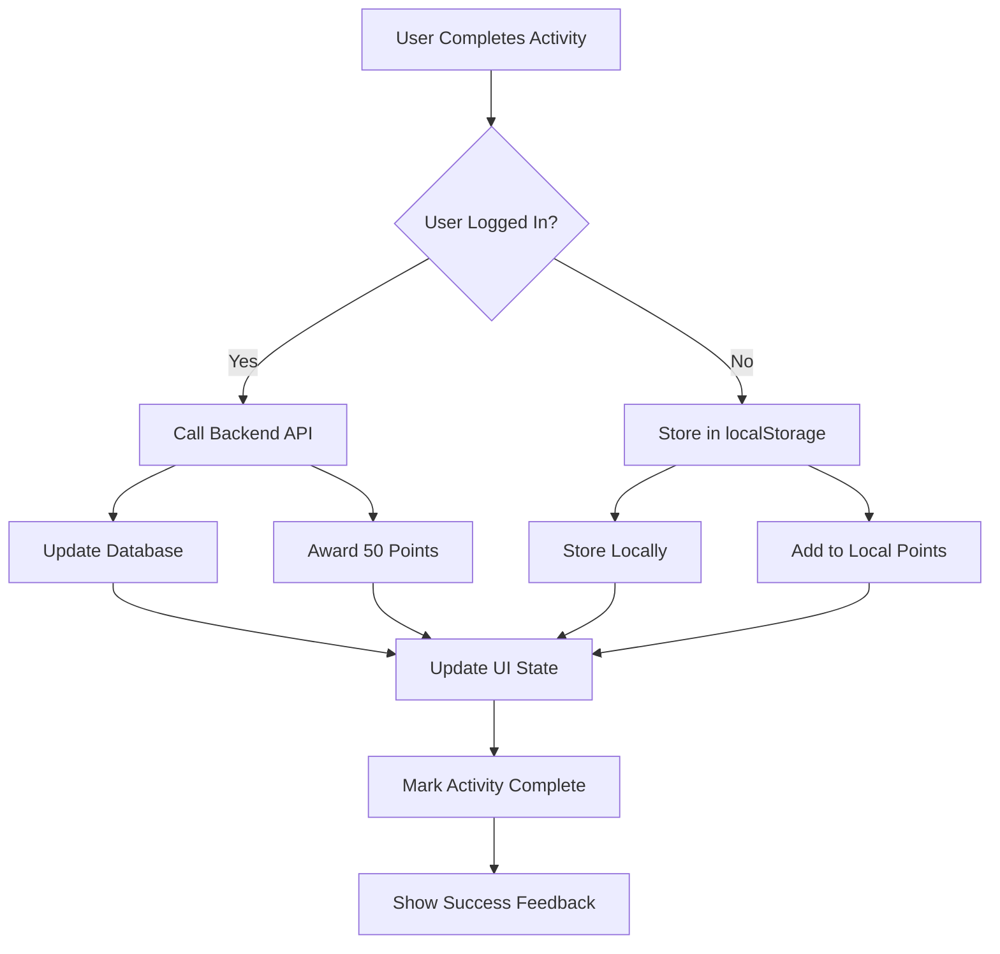
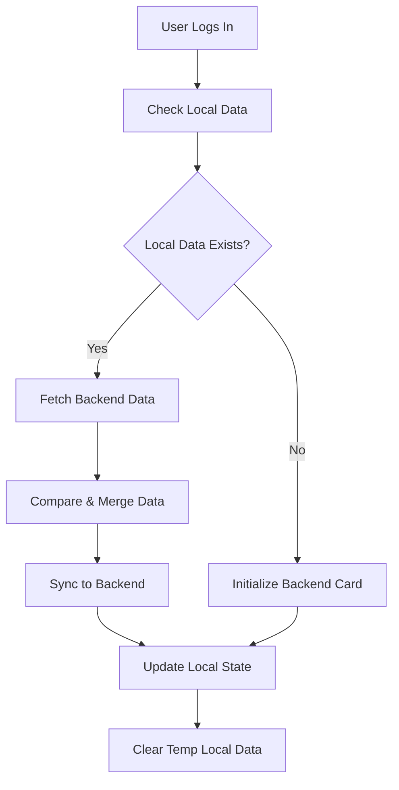

# 🎯 Rewards & Activity Completion System Implementation Plan

## 📊 Current Implementation Analysis

### ✅ **What's Already Working**
- Backend reward system with SQLite database
- Frontend reward store with localStorage persistence
- Authentication system with guest and logged-in user support
- Language learning pages (Hindi, English, Malayalam) with activity tracking
- Basic activity completion tracking in localStorage
- Backend API endpoints for rewards, progress, and activity completion

### 🔧 **What Needs to be Implemented**
1. **50 Points per Activity Completion** - ✨ New Feature
2. **Backend API Integration for Logged Users** - 🔗 Integration
3. **Activity Completion Marking & Persistence** - 📝 Enhancement
4. **Local Storage for Non-logged Users** - 💾 Fallback
5. **Sync System for Authentication State Changes** - 🔄 Sync Logic
6. **Rewards Game/Claim System** - 🎮 Feature Enhancement

---

## 🚀 **Batch Implementation Plan**

### **Batch 1: Core Activity Completion System**
**Priority: HIGH** | **Estimated Time: 4-6 hours**

#### Tasks:
1. **Create Activity Completion Hook (`useActivityCompletion`)**
   - Manage activity completion state
   - Handle 50 points reward per completion
   - Check authentication status
   - Route to backend API or localStorage

2. **Update Language Learning Pages**
   - Hindi Learning: Integrate activity completion hook
   - English Learning: Integrate activity completion hook  
   - Malayalam Learning: Integrate activity completion hook
   - Mark activities as completed with visual indicators

3. **Create Activity Completion Service**
   - API service for backend communication
   - Local storage service for offline users
   - Sync mechanism between local and backend

#### Success Criteria:
- [x] All language learning activities award 50 points on completion
- [x] Completed activities are visually marked 
- [x] Points are correctly tracked for both logged and guest users
- [x] Activities can only be completed once per user

---

### **Batch 2: Authentication-Aware Persistence**
**Priority: HIGH** | **Estimated Time: 3-4 hours**

#### Tasks:
1. **Backend API Integration**
   - Implement `/api/activities/complete` endpoint usage
   - Implement `/api/rewards/award-points` endpoint usage
   - Error handling and retry logic

2. **Local Storage Management** 
   - Store completed activities for guest users
   - Store points and progress locally
   - Handle data structure for multiple activities

3. **Authentication State Monitoring**
   - Listen for login/logout events
   - Trigger sync when authentication state changes
   - Handle data migration between local and backend

#### Success Criteria:
- [x] Logged users have data persisted to database
- [x] Guest users have data persisted to localStorage
- [x] No data loss during authentication state changes
- [x] Proper error handling for network failures

---

### **Batch 3: Sync System Implementation**
**Priority: MEDIUM** | **Estimated Time: 4-5 hours**

#### Tasks:
1. **Create Sync Service (`useSyncService`)**
   - Compare local and backend data
   - Merge activity completion data
   - Handle conflict resolution
   - Background sync capabilities

2. **Login Sync Process**
   - Check for local data when user logs in
   - Migrate local achievements to backend
   - Update reward points in backend
   - Clean up local data after successful sync

3. **Logout Preservation**
   - Store current progress to localStorage before logout
   - Maintain guest session data
   - Handle re-login data restoration

#### Success Criteria:
- [x] Local data syncs to backend on login
- [x] No duplicate points or activities after sync
- [x] Progress preserved during logout/login cycles
- [x] Conflict resolution works correctly

---

### **Batch 4: Enhanced Rewards & Games System**  
**Priority: MEDIUM** | **Estimated Time: 5-6 hours**

#### Tasks:
1. **Rewards Claiming Interface**
   - Update RewardsPage with point spending
   - Add confirmation dialogs for purchases
   - Handle insufficient points gracefully
   - Show transaction history

2. **Mini-Games Unlock System**
   - Create point-based game access
   - Implement game completion rewards
   - Add difficulty-based point requirements
   - Track game progress and achievements

3. **Achievement System Enhancement**
   - Add activity-specific achievements
   - Language learning milestones
   - Perfect score achievements
   - Learning streak achievements

#### Success Criteria:
- [x] Users can spend points on rewards/games
- [x] Games are locked/unlocked based on points
- [x] Achievement system tracks learning progress
- [x] Points balance updates in real-time

---

### **Batch 5: Testing & Polish**
**Priority: LOW** | **Estimated Time: 2-3 hours**

#### Tasks:
1. **Integration Testing**
   - Test all activity completion flows
   - Test sync between local and backend
   - Test reward spending and earning
   - Test authentication state changes

2. **User Experience Polish**
   - Add loading states for API calls
   - Improve error messages and feedback
   - Add success animations for completions
   - Optimize performance for large datasets

3. **Documentation & Logging**
   - Update API documentation
   - Add debug logging for troubleshooting
   - Create user guide for rewards system
   - Document sync behavior and limitations

#### Success Criteria:
- [x] All edge cases handled gracefully
- [x] Smooth user experience across all flows
- [x] Comprehensive error handling and recovery
- [x] Performance optimized for scale

---

## 📁 **File Structure & Components**

### **New Files to Create:**
```
client/src/
├── hooks/
│   ├── useActivityCompletion.tsx       # Main activity completion logic
│   └── useSyncService.tsx             # Data sync between local/backend
├── services/
│   ├── activityCompletionService.ts   # API calls for activity completion
│   └── syncService.ts                 # Sync logic implementation  
├── components/
│   ├── ActivityCompletionBadge.tsx    # Visual completion indicator
│   ├── PointsEarnedModal.tsx          # Success modal for earning points
│   └── RewardUnlockNotification.tsx   # Notification for unlocked rewards
└── utils/
    ├── activityLocalStorage.ts        # Local storage utilities
    └── pointsCalculation.ts           # Points calculation utilities
```

### **Files to Modify:**
```
client/src/
├── pages/
│   ├── HindiLearning.tsx             # Add completion tracking
│   ├── EnglishLearning.tsx           # Add completion tracking
│   ├── MalayalamLearning.tsx         # Add completion tracking
│   └── RewardsPage.tsx               # Enhanced spending interface
├── hooks/
│   └── useAuth.tsx                   # Add sync triggers
├── stores/
│   └── rewardStore.ts                # Backend integration
└── services/
    └── apiService.ts                 # New activity completion endpoints
```

---

## 🎯 **Implementation Details**

### **Activity Completion Flow:**


### **Sync Process Flow:**


### **Points System:**
- **Activity Completion**: 50 points (base reward)
- **Perfect Score Bonus**: +25 points (score = 100%)
- **First Time Activity**: +10 points  
- **New Category**: +15 points
- **Daily Streak**: +5 points per day
- **Weekly Streak**: +50 points bonus

### **Storage Strategy:**
- **Logged Users**: Primary storage in SQLite database via backend API
- **Guest Users**: Primary storage in localStorage with structured data
- **Sync Strategy**: Merge local achievements with backend on login
- **Conflict Resolution**: Backend data takes priority, local data adds new items

---

## 🔍 **Technical Specifications**

### **Data Structures:**

#### Activity Completion:
```typescript
interface ActivityCompletion {
  activityId: string;
  languagePage: string; // 'hindi' | 'english' | 'malayalam'
  completedAt: string;
  score?: number;
  timeSpent?: number;
  pointsEarned: number;
}
```

#### Local Storage Schema:
```typescript
interface LocalActivityData {
  userId: string; // guest user ID
  completedActivities: ActivityCompletion[];
  totalPoints: number;
  lastSyncAttempt?: string;
  needsSync: boolean;
}
```

#### API Endpoints:
```typescript
// New endpoints to implement
POST /api/activities/complete
GET /api/activities/completed/:userId
POST /api/rewards/award-points
GET /api/rewards/cards/:userId
POST /api/rewards/sync-local-data
```

---

## 🎮 **Rewards & Games Integration**

### **Point Spending Categories:**
1. **Mini-Games Access** (25-100 points)
   - Memory games, puzzles, quizzes
   - Difficulty-based pricing
   - Additional rewards for game completion

2. **Customization Items** (10-50 points)
   - Avatar accessories, themes
   - Learning interface customization
   - Achievement badges and titles

3. **Educational Content** (30-75 points)
   - Additional language lessons
   - Cultural content unlocks
   - Advanced learning materials

4. **Real-World Rewards** (100-500 points)
   - Require parent approval
   - Physical items, experiences
   - Digital subscriptions

### **Achievement Milestones:**
- **Language Explorer**: Complete 10 activities in each language (100 points)
- **Perfect Student**: Get 100% on 5 activities (150 points)
- **Dedicated Learner**: 7-day learning streak (200 points)
- **Master Student**: Complete all activities in one language (500 points)

---

## 📈 **Success Metrics**

### **Functional Requirements:**
- [ ] Activities award exactly 50 points on completion
- [ ] Completed activities are permanently marked
- [ ] Points persist across sessions (local or backend)
- [ ] Sync works seamlessly during login/logout
- [ ] No duplicate points or completions
- [ ] Error handling prevents data loss

### **Performance Requirements:**
- [ ] Activity completion response < 500ms
- [ ] Sync process completes < 3 seconds
- [ ] Local storage operations < 100ms
- [ ] Backend API calls have proper timeout handling

### **User Experience Requirements:**
- [ ] Clear visual feedback for completed activities
- [ ] Smooth transitions during point awards
- [ ] Intuitive rewards claiming interface
- [ ] Helpful error messages and recovery options
- [ ] Progress preservation across authentication changes

---

## 🚀 **Next Steps**

1. **Start with Batch 1** - Core activity completion system
2. **Create the activity completion hook and service**
3. **Update one language page as a prototype**  
4. **Test the basic flow end-to-end**
5. **Proceed to authentication-aware persistence**
6. **Continue with remaining batches in order**

This implementation plan ensures a systematic approach to building a robust rewards and activity completion system that works seamlessly for both authenticated and guest users, with proper data persistence and sync capabilities.